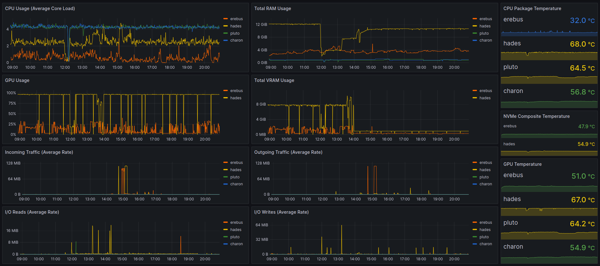

# flameglow
A basic Linux OS stats collection agent/Prometheus client meant to serve as code reference and/or light use. It uses the /proc filesystem as a local data source and /sys for temperature readings.

## What do I need to do to get it running on my PC?

**-** You will need a **python3.6+** environment. Most Linux distros will come with python3 installed - make sure you pick one which comes with **python 3.6** or above.

**-** The following python3 package needs to be installed: `prometheus_client (& dependencies)`. I leave the details up to you. As long as they're in the PYTHONPATH, chiatter will not complain.

**-** HTTP port 8180 must be open for business (firewalls included), since the Prometheus server will need to access it in order to scrape and aggregate all the stats.

## A Prometheus sever? Grafana? How the heck am I supposed to get those?

It's up to you, really - the simple way is to use docker. You can find sample prometheus config files online as reference, but in short you just need to point it to port 8180 on the host(s) flameglow is running on and it will start scraping.

## What are all the various non-self-explanatory configuration options?

**-** **network_interface_name:** partial filter used to identify the network interface which will be used for collecting stats. If your interface is `enp3s0` for example, then using `enp` will be sufficient, assuming it's the only interface which starts with enp on the system.

**-** **host_type:** can be either `generic` or `raspberrypi`. Used to determine thermal zone paths in the /sys filesystem.

**-** **gpu_type:** can be `nvidia`, `amd` or `none`. `none` will disable the gpu temperature stats submodule. Note that testing on `amd` has not been extensive.

## Anything else I need to know?

Once you get Grafana running for the first time, you will need to create a Prometheus datasource in order to get those nice stats loaded for the charts and all. Here's a nifty screenshot on how to do that (it's simple really):

## Charts? Dashboards? Where, how?

I've included a sample dashboard of my very own design. Use the provided `.json` file (under `misc`) to import it from Grafana.

## Nothing works! What do I do?

Exactly what you'd do in other situations when nothing works. Raise an issue on github and I'll reply as soon as I can.

